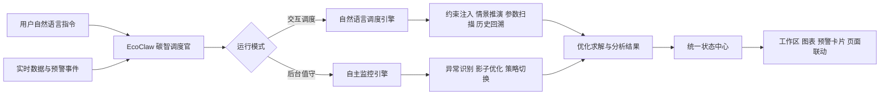

# Agent模块设计方案：EcoClaw（碳智调度官）

> **文档性质**：面向项目说明书中“调度Agent”部分的正式设计说明。  
> **文档目标**：从项目整体展示的角度，说明 `EcoClaw（碳智调度官）` 的角色定位、核心能力、自主执行架构与项目价值。  
> **适用范围**：智慧园区节能减排综合调度平台中的自然语言调度、情景推演、约束注入、后台值守、主动预警、历史回溯与策略联动。

## 1. EcoClaw（碳智调度官）定位

如果说近期 OpenClaw 一类自主智能体代表了“会做事的 AI”，那么 EcoClaw 则是面向工业园区节能减排场景自主研发的专属赛博调度员工。EcoClaw 不再停留在传统问答助手层面，而是以“理解指令、调用工具、驱动求解、生成结论、联动页面、持续值守”为核心能力，直接参与园区调度分析与策略执行过程。它承担的不是单一聊天功能，而是园区节能减排平台中的智能调度中枢，是连接用户意图、实时数据、优化内核和可视化结果的关键枢纽。

EcoClaw 的核心价值在于将原本依赖人工手动配置、手动求解、手动比对和手动解释的调度流程，升级为自然语言驱动的智能执行流程。用户不需要再深入理解复杂参数表单、优化约束语法或多页面分析路径，只需提出一句业务化指令，EcoClaw 就可以自动完成任务理解、约束注入、情景推演、结果比较和策略说明。与此同时，EcoClaw 还以后台常驻的方式持续巡检园区运行状态，对电价、碳因子、负荷变化和预警事件进行实时感知，并在关键异常出现时自主研判、自主告警、自主生成调度建议，从而构建出具备类“数字员工”特征的自主调度智能体。

因此，EcoClaw 既是一个自然语言交互入口，也是一个面向园区节能减排场景的业务执行型智能体。它具备与新一代自主智能体相近的执行特征，但并不是对通用热点概念的简单模仿，而是围绕工业园区多能互补调度、双碳目标约束和实时市场信号联动进行深度行业特化的专属智能系统。

## 2. EcoClaw 的三大核心能力

### 2.1 自然语言调度引擎

EcoClaw 实现了以自然语言直接驱动调度分析的能力，将过去需要人工逐项配置的计算任务转化为一句话即可完成的智能调度流程。用户既可以直接提出“What-If”类问题，例如改变购电上限、改变设备负荷条件、调整能源分配关系，EcoClaw 会自动将其解析为可执行的情景推演任务；也可以使用接近日常业务表达的方式注入运行约束，例如限定某时段购电上限、要求特定设备优先运行或要求某类能源在高峰时段承担更多负荷，EcoClaw 会自动将自然语言转化为结构化约束并驱动优化求解。

这一能力的价值在于显著降低了调度系统的使用门槛。过去，复杂运算往往需要专业人员理解参数意义、手动调整模型输入、反复调用求解器，并在多个页面之间来回比对结果；现在，EcoClaw 将“自然语言输入-约束注入-模型求解-结果对比-结论解释”组织为一条完整链路，使用户能够以接近业务口语的方式直接完成调度计算。与此同时，EcoClaw 还把参数扫描、Pareto 前沿分析和历史时光回溯纳入统一的自然语言调度框架之中，使用户既能做即时推演，也能做典型工况复盘和多方案探索，显著提升了系统的便捷性、专业性和展示冲击力。

### 2.2 自主值守与自适应调度引擎

EcoClaw 并不是一个只有在用户发问时才会工作的被动系统，而是一个能够在后台持续运行的自主调度智能体。它常驻平台后端与侧边栏工作区，持续监控园区运行状态、市场电价、光照变化、动态碳因子和预警事件，形成面向全厂区的智能巡检机制。一旦发现关键指标异常升高、外部市场信号剧烈波动或系统运行状态偏离预期，EcoClaw 会立即进入自主研判流程，对异常原因、影响时段和潜在调度风险进行分析，并基于实时数据自动触发影子优化与策略评估。

这一机制使 EcoClaw 具备了类似值班调度员的主动性。当电价快速升高时，EcoClaw 不仅能够识别这一事件本身，还能够进一步判断其对购电成本、储能调用、燃料电池替代、电解槽运行和碳排表现的影响，并自动生成新的防御型调度方案或收益型切换策略；当碳因子持续偏高时，EcoClaw 也能够主动评估绿电利用和负荷转移路径，推动系统向更低碳的运行方案调整。通过这种“监测-判断-求解-告警-建议”的自主闭环，EcoClaw 将平台从传统的被动展示系统升级为具有实时感知与自适应决策能力的智能调度系统。

### 2.3 赛博员工执行闭环

EcoClaw 的第三个核心能力，是将“会分析”升级为“会执行”。它不是只会回答问题的对话助手，而是一个能够真正接任务、跑计算、切页面、出结果、给建议的赛博调度员工。用户发出任务后，EcoClaw 会自动理解需求类型，判断是解释型任务还是执行型任务；在执行型任务中，它会自动调用优化求解、实时数据读取、预警分析、策略切换、页面跳转和历史回溯等工具链，并把最终结果写回到统一状态中心和可视化工作区中。

这一执行闭环带来的最大优势，是所有智能分析都具备明确的业务落点。EcoClaw 给出的结果不只是文字说明，而是会直接体现在工作区图表、方案对比表、Pareto 前沿结果、预警卡片和页面联动之中。它既能告诉用户“为什么这样调度”，也能直接把用户带到“应该看哪里、应该怎么比较、应该采用什么方案”的结果界面。正因为 EcoClaw 具备这种完整的执行闭环，它才真正具备“赛博员工”的角色特征，也使项目在评审视角下更容易呈现出智能体系统的完整度与先进性。

## 3. EcoClaw 的自主执行架构

EcoClaw 采用“前台响应用户、后台持续值守、统一结果回写”的自主执行架构。面向用户交互时，EcoClaw 通过自然语言入口接收任务，结合页面上下文、激活策略、关键指标和完整时序数据进行意图理解，并将任务分发到自然语言调度引擎；面向后台值守时，EcoClaw 则持续接收实时数据流和预警事件流，对市场波动和运行异常开展主动分析，并在必要时触发影子优化和策略切换评估。无论任务来自前台用户指令还是后台监测事件，所有结果最终都会汇入统一状态中心，并同步回写到工作区、图表区和预警卡片中，实现一致的展示与执行闭环。

EcoClaw 既响应用户指令，也在后台持续运行，具备类似赛博员工的自主巡检与调度执行能力。其架构设计将语言理解、任务执行、异常响应和结果展示组织为统一闭环，使系统既能够在交互场景中表现出极高的易用性，也能够在实时运行场景中体现出稳定、主动和可靠的智能调度特征。

## 4. EcoClaw 如何实现后台值守与主动决策

EcoClaw 的后台值守机制建立在实时数据接入、异常检测、影子优化和主动预警四个环节之上。系统持续接收市场电价、光照预测、动态碳因子和园区运行状态，并通过预警识别机制快速捕捉异常变化，例如电价尖峰、碳因子抬升、关键时段成本压力增加或某类设备运行状态偏离常态。对于这些事件，EcoClaw 不会止步于简单提示，而是进一步结合实时数据和调度模型开展主动分析，判断异常会对园区成本、碳排、绿电利用和设备策略造成怎样的影响。

在完成判断之后，EcoClaw 会自主触发影子优化，快速生成新的备选方案，并把新的调度结果与原始方案进行结构化比较，形成对用户可直接理解的策略建议。这意味着平台中的主动预警不只是“发生了什么”，而是“发生了什么、为什么重要、应该如何应对、切换后会带来怎样的收益变化”。当用户进入工作区时，EcoClaw 已经完成了从事件感知到方案生成的主要流程，从而把人工依赖的应急分析过程转化为智能体驱动的实时决策过程。

这种后台值守能力尤其适合工业园区节能减排场景。一方面，园区运行与市场信号的耦合程度高，电价、碳因子和可再生能源条件都可能在短时间内显著变化；另一方面，人工调度难以做到全天候高频监控与快速重算。EcoClaw 通过后台常驻、自主巡检和自动求解，使系统真正具备了“像调度员一样值守、像分析师一样研判、像执行者一样联动”的综合能力，这也是其区别于传统问答型 Agent 的关键所在。

## 5. 难点与解决

EcoClaw 实现中的关键难点，在于如何把高度开放的自然语言输入，稳定转化为可执行、可追踪、可解释的调度动作。相比传统参数表单，用户的表达往往更灵活、更口语化，如果直接把自然语言结果送入优化求解过程，极易出现语义歧义、执行失控或结果不可解释的问题。为解决这一难点，EcoClaw 采用了“语言理解与业务执行解耦”的设计思路：前端与后端先将用户意图解析为结构化工具调用，再由约束注入、情景推演、实时分析和页面联动等执行链路完成具体任务，所有结果统一回写到状态中心和工作区中展示。通过这种方式，EcoClaw 既保留了自然语言交互的便捷性，又保证了调度过程的可控性、结果的可追踪性和策略建议的可解释性。

## 6. EcoClaw 的项目价值

EcoClaw 将智慧园区节能减排平台的智能化水平提升到了新的层级。它一方面以自然语言调度能力大幅降低了复杂优化模型的使用门槛，使非算法背景用户也能够直接发起高质量调度分析；另一方面以后台自主值守和主动预警机制提升了系统面对实时市场变化和运行异常时的响应速度与决策质量。更重要的是，EcoClaw 通过完整的赛博员工执行闭环，把“理解问题”“完成计算”“输出方案”“联动展示”四个环节真正打通，使整个平台从传统的数据展示系统升级为能够主动工作、主动分析和主动建议的自主调度系统。

对于项目说明书和竞赛评审而言，EcoClaw 还提供了极强的叙事张力与记忆点。它既回应了新一代自主智能体技术的发展趋势，又建立了属于园区节能减排场景的专属概念；既体现了大模型与优化调度结合的技术深度，也体现了实时数据、主动预警和自主执行闭环带来的工程完成度。通过 `EcoClaw（碳智调度官）` 这一主概念，项目不再只是“接入了 Agent”，而是形成了一个具备鲜明识别度、强展示感染力和清晰业务价值的赛博调度员工系统。
