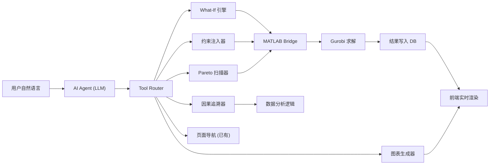
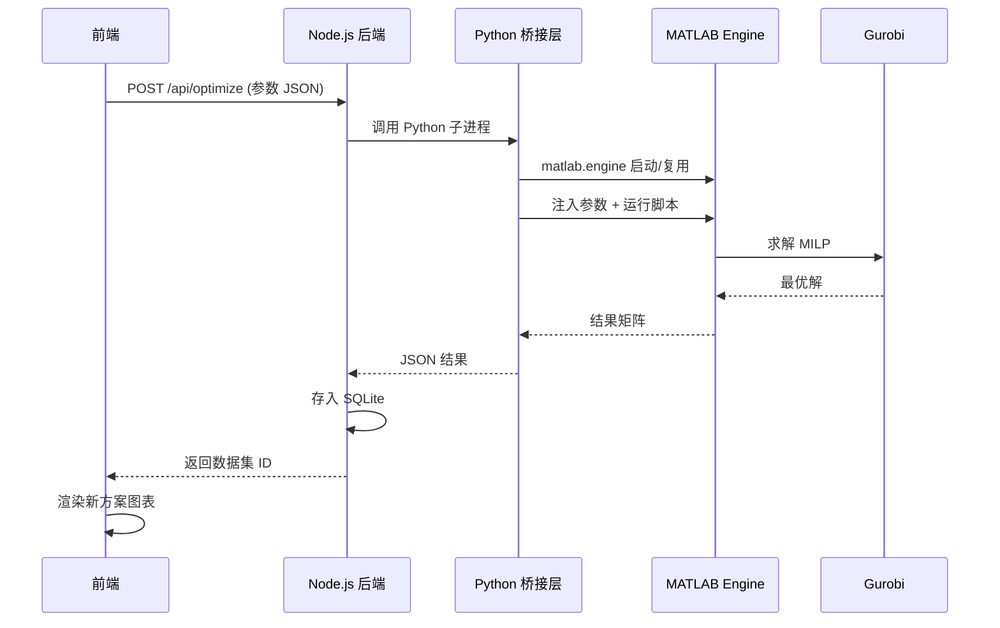

# Agent 能力升级方案

## 整体架构

## 关键前提：MATLAB 与 Web 的桥接

4 个 MATLAB 脚本（`e:\科研绘图\matlab程序\*.m`）使用 YALMIP + Gurobi 求解。需要一个桥接层让 Node.js 后端能调用 MATLAB 并获取结果。

### 推荐方案：Python 中间层 + MATLAB Engine

**具体路径**：

- 将 4 个 .m 文件重构为 1 个参数化函数 `optimize_system.m`，接收参数 struct，返回结果 struct
- Python 脚本通过 `matlab.engine` 调用该函数
- Node.js 通过 `child_process.spawn` 调用 Python 脚本

**备选方案**（如果部署环境无 MATLAB）：

- 将 MATLAB 模型移植为 Python + `gurobipy`（约 200 行代码量），完全去除 MATLAB 依赖

## 五大 Agent 能力设计

### 能力一：What-If 情景推演引擎

**Agent Tool**：`run_whatif`

**交互示例**：

> 用户："如果明天光照强度下降 30%，电价上涨 20%，最优调度策略会怎么变？"
> Agent：
>
> 1. 解析语义 → 提取参数修改：`G_irradiance *= 0.7`, `price_grid *= 1.2`
> 2. 调用 `POST /api/optimize`，传入修改后的参数
> 3. 等待求解完成（约 5-30 秒）
> 4. 对比新旧方案：成本变化、碳排变化、各设备功率变化
> 5. 自动生成对比图表并展示

**可调参数范围**（从 MATLAB 代码提取）：

- `n_PV`：光伏组件数量（默认 10000）
- `G_irradiance`：24h 光照强度曲线
- `price_grid`：24h 分时电价
- `EF_grid`：24h 碳排放因子
- `c_carbon`：碳交易价格（默认 90 元/tCO2）
- `H_max`：储氢罐容量（默认 1200 Kmol）
- `ES_max`：储能容量
- 目标函数权重：成本 vs 碳排放（默认 0.5:0.5）

### 能力二：自然语言约束注入

**Agent Tool**：`add_constraint`

**交互示例**：

> 用户："在 19:00-21:00 碳排放高峰时段，电网购电功率限制在 3000kW 以内"
> Agent：
>
> 1. 解析为约束：`P_grid(19:21) <= 3000`
> 2. 注入 MATLAB 模型的约束集合
> 3. 重新求解并展示结果
> 4. 对比说明："添加约束后，高峰时段购电降低 45%，但总成本上升 3.2%"

**支持的约束类型**：

- 设备功率上下限（`P_CA`, `P_grid` 等）
- 时段限制（指定时段的参数约束）
- 储氢量边界调整
- 产氢目标调整

### 能力三：跨设备因果链路追溯

**Agent Tool**：`trace_causality`

不需要调用 MATLAB，纯数据分析 + LLM 推理。Agent 从已有数据中追溯能量流和氢气流的因果关系。

**交互示例**：

> 用户："为什么 ES 方案在第 17 小时电网购电功率突然飙升到 7205kW？"
> Agent 分析链路：
>
> 1. 检查第 17 小时各设备状态
> 2. 追溯：光伏出力 1464.5kW（日落下降） → 储氢罐存储量 1.897t（接近上限，无法继续储氢） → 燃料电池出力仅 552kW（氢气受限）→ 电力缺口需电网补充 7205kW
> 3. 生成因果链流程图
> 4. 给出建议："若增加储氢罐容量至 1500 Kmol，可缓解此时段的电网依赖"

**实现方式**：在 `useAgentContext` 中增加完整的 24h 全量数据注入（不仅是 P_CA 摘要），让 LLM 拥有完整的数据上下文进行推理。同时提供一个 `trace_causality` tool，预计算各时段的能量平衡和氢气平衡，结构化后传给 LLM。

### 能力四：多轮自主 Pareto 前沿探索

**Agent Tool**：`pareto_scan`

**交互示例**：

> 用户："帮我分析光伏组件数量从 5000 到 30000 时，成本和碳排放的变化趋势"
> Agent：
>
> 1. 解析扫描范围：n_PV = [5000, 10000, 15000, 20000, 25000, 30000]
> 2. 依次调用优化器（6 次求解）
> 3. 收集每次的 cost/carbon/combined
> 4. 绘制 Pareto 前沿散点图
> 5. 标注最优区间并给出建议："n_PV=15000-20000 是成本-碳排的最佳平衡区间"

### 能力五：动态图表生成

**Agent Tool**：`generate_chart`

**交互示例**：

> 用户："给我看各方案在白天时段（8:00-18:00）的平均电网购电对比"
> Agent：
>
> 1. 从数据集筛选 t=8~18 的 P_G 数据
> 2. 计算各方案均值
> 3. 生成柱状图配置（ECharts option）
> 4. 在聊天窗口或主区域动态渲染图表

## 实施路径（分 4 个阶段）

### 阶段一：基础设施（MATLAB 桥接 + 参数化重构）

**核心文件变更**：

- 新建 `server/matlab/optimize_system.m`：将 4 个 .m 文件合并为 1 个参数化函数
- 新建 `server/python/run_optimizer.py`：Python 桥接脚本
- 修改 `server/index.js`：新增 `POST /api/optimize` 接口
- 修改 `server/routes/datasets.js`：支持保存新的优化结果

### 阶段二：Agent Tool 扩展

**核心文件变更**：

- 修改 `src/lib/agentActions.ts`：注册新的 tool 类型
- 修改 `src/hooks/useAgentChat.ts`：处理异步长时间操作（优化求解需要 5-30s）
- 修改 `src/hooks/useAgentContext.ts`：注入完整 24h 数据上下文
- 修改 `server/index.js`：在 TOOLS 数组中增加新的 function 定义

### 阶段三：前端交互增强

**核心文件变更**：

- 新建 `src/components/agent/AgentChartPanel.tsx`：Agent 动态生成的图表面板
- 新建 `src/components/agent/OptimizationProgress.tsx`：求解进度指示器
- 新建 `src/pages/ScenarioComparePage.tsx`：What-If 方案对比页面
- 修改 `src/context/StrategyContext.tsx`：支持动态加载新数据集

### 阶段四：高级能力

- 因果链路追溯的结构化推理
- Pareto 前沿批量扫描与可视化
- 自然语言约束的语义解析与校验

