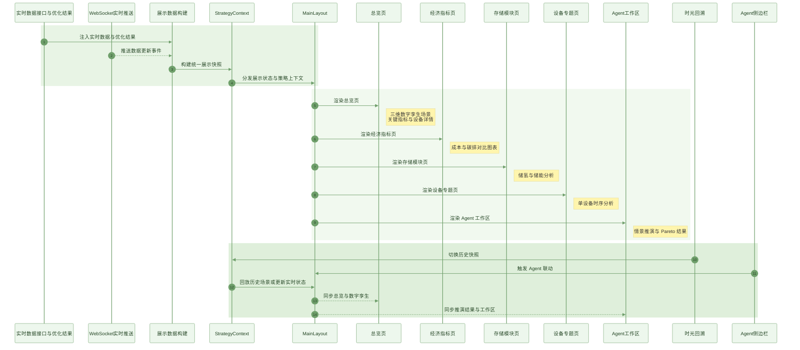

# 可视化平台设计方案

> **文档性质**：面向项目说明书中“可视化平台”部分的正式设计说明。  
> **文档目标**：从项目整体介绍的角度，说明可视化平台的系统定位、展示能力、交互逻辑与技术设计思路。  
> **适用范围**：智慧园区节能减排综合调度平台中的总览展示、实时监测、设备分析、历史回溯与 Agent 结果承接。

## 1. 平台定位

可视化平台是智慧园区节能减排综合调度平台的人机交互主控台，是项目将实时数据、优化调度结果和智能体分析能力统一呈现给用户的核心界面层。平台承担的任务并不仅仅是展示图表，而是围绕园区多能互补系统的运行过程，构建一个集总览感知、实时监测、历史复盘、设备分析、方案比较和智能交互于一体的数字化工作台。通过这一平台，复杂的调度模型、实时信号和策略结果被转化为可视、可交互、可解释的界面对象，使系统的运行逻辑、优化思路和决策价值能够被直观理解。

可视化平台在项目中承担三方面作用。首先，它承担园区运行态势的直观表达任务，将电价、光照、碳因子、设备功率、储氢水平和综合指标统一组织到同一工作界面中，帮助用户快速建立全局认知。其次，它承担优化结果的解释与比较任务，使不同调度策略在成本、碳排、绿电利用和供能结构上的差异能够以图表、指标卡和对比视图的方式清晰呈现。再次，它承担 Agent 智能分析结果的承接任务，使自然语言触发的情景推演、参数扫描、因果追溯和历史回溯都能稳定落到具体页面和可视对象中，形成完整的交互闭环。

## 2. 整体展示架构

可视化平台采用“统一框架承载、多页面协同展示、全局状态统一驱动”的总体架构。平台以主框架页面为承载基础，在统一导航、统一状态栏和统一 Agent 侧边栏之下组织总览页、经济指标页、存储模块页、设备专题页和 Agent 工作区等多个页面模块，并通过统一的数据状态中心驱动各页面同步展示。这样的架构能够保证平台在页面切换、策略切换、实时刷新、历史回放和场景对比过程中始终保持一致的数据口径和交互逻辑。

平台的顶栏区域承担系统级状态展示功能，集中呈现数据源健康状态、数据快照时间、时光回溯入口、园区配置入口和系统日志信息；导航区域承担页面切换与策略切换功能，使用户能够在总览展示、专题分析和智能工作区之间快速切换；中部主工作区承担各类业务图表、数字孪生场景和方案比较视图；右侧 Agent 侧边栏承担智能问答、任务执行、历史会话和主动预警展示。整体布局将“看板、分析、交互、推演”四类功能收拢到一个连续工作界面内，形成了统一的调度分析主控台。

平台的数据展示以统一状态模型为基础。系统通过全局状态中心维护展示数据快照、数据元信息、当前策略、场景推演结果、Pareto 扫描结果和当前时间索引，使总览页、指标页、专题页和 Agent 工作区都基于同一份数据快照进行联动渲染。这种设计保证了用户在任意页面看到的运行结果都来自同一调度场景，避免了传统多页面系统中常见的数据口径不一致问题。

## 3. 主要展示能力设计

平台面向园区综合能源调度场景，集中展示“全局态势感知 + 多策略结果对比 + 智能指挥决策”三类核心能力：一方面可通过三维数字孪生场景、关键指标卡、设备状态灯和能量流线，直观呈现电解槽、光伏、燃机、PEM、电网、储氢与储能等对象的实时运行状态；另一方面可系统展示不同优化策略以及 What-If 推演、Pareto 扫描带来的成本、碳排、综合指标和关键设备运行差异；同时，平台还能承接 EcoClaw 生成的应急调度、设备异常处置和投资建设规划结果，完整呈现 4 小时多设备联动曲线、事件时间线、风险热区、异常指标、ROI 回本分析与投资报告，并支持实时监测与历史复盘，使评委能够一目了然地看到系统“看得见、比得出、能推演、会决策”的整体能力。

## 4. 实时监测与历史回溯设计

可视化平台围绕园区调度场景构建了“实时监测 + 历史回溯”双时态分析能力。平台通过实时数据接口与 WebSocket 推送机制持续接收电价、光照、碳因子、预警信息和优化结果更新，并将这些变化同步映射到顶栏状态、图表曲线、指标卡和总览场景中，使用户能够即时感知外部环境变化对园区调度结果的影响。平台同时提供数据源健康状态展示能力，能够直观区分真实数据源、模拟数据源和兜底数据源，提高展示过程的透明度和可信度。

在历史回溯方面，平台提供按日期回放和历史快照切换能力。用户可以围绕某一典型日期加载对应的展示数据，查看当日电价、光照、碳因子和调度结果，并结合图表、数字孪生场景和 Agent 分析开展时光回溯式复盘。历史回溯机制使平台不仅能够展示系统“此刻如何运行”，也能够展示系统“在过去某一工况下如何决策”，从而增强项目在答辩展示、案例分析和方案验证中的说服力。

实时刷新与历史回放通过统一状态控制机制进行区分。实时模式强调自动更新和全站同步，保证系统能持续响应数据变化；历史模式强调快照冻结和稳定浏览，保证用户在复盘过程中获得完整一致的历史场景。这种双模式设计体现了平台面向真实调度分析场景的工程化考虑。

## 5. 技术设计思路

可视化平台遵循“统一数据驱动、多层级表达、强交互联动”的设计思路。首先，平台以统一数据快照作为所有页面和组件的共同输入，使图表、指标卡、数字孪生场景和 Agent 工作区都围绕同一组调度结果展开表达，从根本上保证了展示结果的一致性。其次，平台通过二维图表与三维场景相结合的方式实现多层级展示，二维图表承担精确数值比较和时序趋势分析任务，三维数字孪生承担空间感知、设备联动和运行态势表达任务，两者相互补充，共同构成兼顾专业性与观赏性的展示体系。

再次，平台强调强交互联动机制。设备点击可以触发镜头聚焦与详情展示，策略切换可以驱动全站图表和场景同步更新，时光回溯可以切换整个平台的数据快照，Agent 指令可以直接驱动工作区切换和结果展示，主动预警可以直接触发用户关注新的调度场景。通过这些联动机制，平台不再是单向输出信息的大屏，而是成为能够支持探索式分析、解释式展示和交互式演示的综合工作台。

从技术复杂度上看，可视化平台整合了前端多页面路由、全局状态管理、ECharts 业务图表、Three.js 数字孪生、WebSocket 实时推送、历史快照切换、智能体侧边栏联动等多个层次。平台既要保证高频数据更新下的渲染一致性，又要保证复杂交互下的状态可控性，还要兼顾三维场景表现力与整体首屏性能。因此，这一平台不仅承担视觉呈现任务，也体现了项目在前端架构设计、实时交互设计和复杂业务可视化组织方面的系统性能力。

## 6. 结论

可视化平台构建了一个面向园区综合能源调度场景的统一数字化展示空间。它将实时数据、优化结果、设备状态、历史工况和 Agent 智能分析能力有机融合，使园区多能互补系统的运行过程、优化逻辑和决策价值能够被直观、连续和可解释地呈现出来。通过这一平台，项目实现了从“模型有结果”到“结果能展示、能比较、能推演、能复盘”的关键跃迁，也显著增强了系统的展示感染力、交互完整性和智能化水平。
